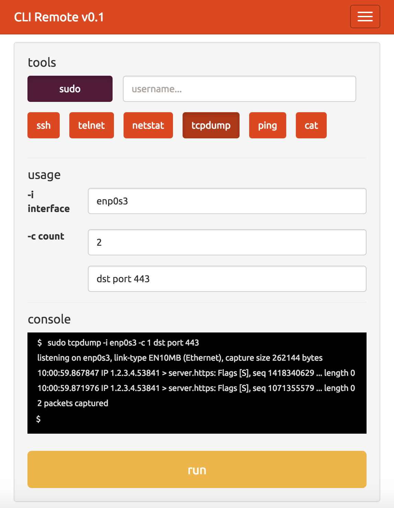

# cli-remote
A responsive mobile gui/cli for interacting with machines via SSH

### How it (will) work
The idea is to simplify server administration with a phone or tablet device when there is no access to a desktop and no specialized (or free) mobile tool available. There needs to be something that provides great flexibility but at the same time not requiring too much effort, like typing long commands from a phone keyboard. This is an AngularJS web app optimized for mobile devices, but native iOS and Android clients will also follow.

Users will be presented with standard administrative tools and usage options, and they will also be able to add their own. While a user selects different options, the command will be automatically generated in the built-in console, which will also allow editing/previewing before submission.

### Visualization and GUI

### Current challenge
Finding the right js library for communicating **directly with acceptable security** to a target SSH server.
